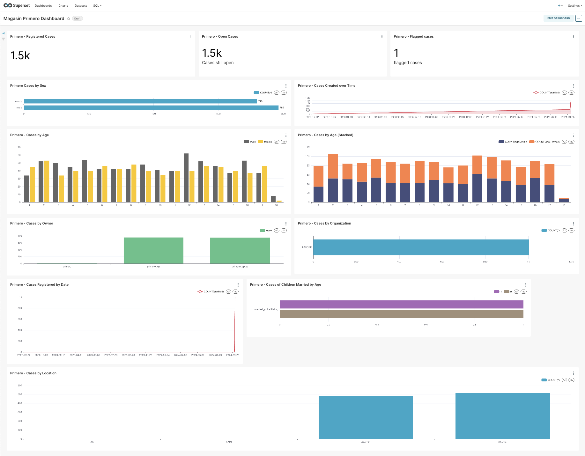

# magasin-primero-paquet - Unlock the Full Potential of Your Primero Data


This repository allows you to visualize in a beautiful dashboard your data from [Primero](https://www.primero.org), the open-source child protection case management system, using [magasin](https://magasin.unicef.io).

This is a _paquet_ for magasin is a collection of code and configurations that allows you to extract, analyze, and visualize data from Primero.

As a result of setting up this _paquet_ you will have a dashboard with insights about the cases and incidents of primero that gets fresh data from your Primero instance every day. 



Alternatively, if you want do data explorations with the data extracted from Primero you can use the [Jupyter notebook](./explorations/primero.ipynb) in the `explorations/` folder. 

## What is Magasin?

Magasin is a foundational toolset designed to help data analysis teams uncover valuable insights. It enables organizations to extract, analyze, and visualize data from multiple sources. As the only complete, open-source, cloud-based data and AI toolset, Magasin grows with your organization, empowering you to make better decisions with clear and impactful insights throughout your digital transformation journey. 

Magasin is a certified [Digital Public Good (DPG)](https://github.com/unicef/magasin/discussions/103).

👉 **[Learn more about magasin](https://magasin.unicef.io/)**

## Pre-requisites

In order to extract the full potential of this integration, ie. to have a full dashboard, you need to have:

- [A magasin instance](https://magasin.unicef.io/get-started/). For testing purposes you can install magasin in a regular computer.
- Credentials to log into a Primero 2.x instance. For testing you can get them from the demo instance clicking on the [Try button on the top right corner](https://support.primero.org/).

Experience with command line and python programming language may be useful. 

It is also recommended to have followed the [magasin getting started tutorial](https://unicef.github.io/magasin/get-started/tutorial-overview.html) before trying to install this _paquet_. It will give you a better understanding of the magasin data analysis lifecycle.

## Contents & Repository Structure

This repository is organized following the magasin data analysis lifecycle, that is explained in the [magain getting started tutorial overview](https://unicef.github.io/magasin/get-started/tutorial-overview.html), in which you start [exploring](./explorations/) the data to get valuable insights, then you ingest the data into magasin using [automated pipelines](./pipelines/), and finally you visualize the data using [dashboards](./dashboards/).

So, the repository is organized as follows:

- `explorations/`: Contains some sample code that allows you to analyze the data from Primero using a simple Jupyter notebooks, it allows you to get a grasp of what does the dataset contain and play with it using python code.
- `pipelines/`: Contains the code to ingest data from Primero into magasin using Dagster. Using Primero API it extracts data into a cloud storage (fi. S3 Bucket/MinIO or Azure Blob Storage).
- `dashboards/`: Contains the SuperSet dashboards to visualize the data from Primero.

Additionally 
- `primero_api/`: Contains the a python library to interact with the Primero API.


## Installation

In the computer from which you want to perform the installation of the `magasin-primero-paquet` you need to have also installed the tools used by a magasin administrator. 

To check if you have them installed you can use the following command:

```shell
 curl -sSL https://magasin.unicef.io/install-magasin.sh | bash -s -- -c 
 ```
And you should see something like this:

```shell
[ i ] magasin installer for a MacOS system (Darwin)
[ ✓ ] kubectl installed (/opt/homebrew/bin/kubectl)
[ ✓ ] helm installed (/opt/homebrew/bin/helm)
[ ✓ ] pip3 installed (/Users/username/.pyenv/shims/pip3)
[ ✓ ] mc installed (/opt/homebrew/bin/mc)
[ ✓ ] mag installed (/opt/homebrew/bin/mag)

[ ✓ ] All dependencies are installed.
```

If there is any component missing you can install it using the following command:

```shell
# Debian/Ubuntu / Windows WSL
curl -sSL https://magasin.unicef.io/install-magasin.sh | bash -s -- -i 
# MacOS
curl -sSL https://magasin.unicef.io/install-magasin.sh | zsh -s -- -i 
```
If any of them fails to be installed using the script, try to install them manually.

Ensure kubectl is pointing to the right cluster:

```shell
 kubectl get namespaces
 ```
You should see the namespaces of magasin

```sh
NAME               STATUS   AGE
default            Active   84d
kube-node-lease    Active   84d
kube-public        Active   84d
kube-system        Active   84d
magasin-dagster    Active   13d
magasin-dagster    Active   13d
magasin-daskhub    Active   13d
magasin-drill      Active   13d
magasin-operator   Active   13d
magasin-tenant     Active   13d
magasin-superset   Active   13d
```

Then clone this repository:

```shell
git clone https://github.com/unicef/magasin-primero-paquet
cd magasin-primero-paquet
```

Now, let's install the _paquet_ in your magasin instance. 

## Step 1 - Setup the storage

First you need to setup the cloud storage where the data extracted from Primero will be stored. You can use either S3 Bucket, MinIO or Azure Blob Storage. 

By default magasin includes MinIO. To create a MinIO bucket you can use the following command:

```shell
# create the minio bucket
mag minio add bucket --bucket-name primero
```

```sh
Create Bucket
forward_port command: kubectl port-forward --address=0.0.0.0 --namespace magasin-tenant svc/myminio-hl 9000:9000
Waiting for port to be open...
Port ready.
mc command: mc admin info myminio --insecure
alias check successful
mc command:mc mb myminio/primero2 --insecure
Bucket created successfully `myminio/primero2`.
```

To list the content of the bucket using the following command:

```shell
mc ls myminio/primero 
```
It should be empty at this point.


## Step 2 - Setup the pipeline

The pipeline is a [Dagster](https://dagster.io/) pipeline that extracts data from Primero and stores it in the cloud storage.

Dagster is a framework that allows you to extract data from multiple sources, transform it and load it into multiple destinations giving you some builtin tools to monitor the pipeline and debug it. 

The pipeline extracts the cases, incidents and reports from a primero instance and store it in a [parquet file](https://parquet.apache.org/) in the cloud storage. Parquet is a file format that is optimized for data analysis.


You need to have docker running and have logged in into the container registry where you'll upload the image.


### Setup the secrets

For security reasons, it is recommended to use environment variables to store the credentials to access the Primero API and the cloud storage.  

Update the values with your own information

```sh
kubectl create secret generic magasin-primero-pipeline-secret \
  --namespace magasin-dagster \
  --from-literal=PRIMERO_USER='primero_cp' \
  --from-literal=PRIMERO_PASSWORD='primero2024' \
  --from-literal=PRIMERO_API_URL='http://playground.primerodev.org/api/v2/' \
  --from-literal=FSSPEC_S3_ENDPOINT_URL=http://minio.magasin-tenant.svc.cluster.local \
  --from-literal=FSSPEC_S3_KEY='minio' \
  --from-literal=FSSPEC_S3_SECRET='minio123'
```

Security tips: 
1) In a productive environment, this secret should be managed using a secret store such as Azure Key Vault, AWS Secrets Manager, or HashiCorp Vault.
2) The users on in this pipeline should have the minimum permission possible to access the data.

### Add the pipeline to your dagster instance.

Ok, you already setup the environment variables, now you need to upload the pipeline to your dagster instance.

Assuming you already have magasin-dagster installed in your kubernetes cluster (ie. you ran `magasin-install.sh`)

```sh
helm upgrade dagster magasin/dagster --namespace magasin-dagster -f ./dagster-helm-values.yml 
```
You should sees something like this:
```sh
Release "dagster" has been upgraded. Happy Helming!
NAME: dagster
LAST DEPLOYED: Mon Nov  4 11:37:56 2024
NAMESPACE: magasin-dagster
STATUS: deployed
REVISION: 2
TEST SUITE: None
NOTES:
Launched. You can access the Dagster webserver/UI by running the following commands:

export DAGSTER_WEBSERVER_POD_NAME=$(kubectl get pods --namespace magasin-dagster -l "app.kubernetes.io/name=dagster,app.kubernetes.io/instance=dagster,component=dagster-webserver" -o jsonpath="{.items[0].metadata.name}")
echo "Visit http://127.0.0.1:8080 to open the Dagster UI"
kubectl --namespace magasin-dagster port-forward $DAGSTER_WEBSERVER_POD_NAME 8080:80
```

Note: If you did not run the magasin installer, and want to run the pipeline in the cluster:
    ```sh
    helm repo add magasin https://unicef.github.io/magasin/
    helm install dagster magasin/dagster --namespace
    magasin-dagster -f ./dagster-helm-values.yml --create-namespace
    ```


## 2.1 Run the pipeline for testing it is working

Check the content of the bucket using the following command:

```shell
mc ls myminio/primero 
```

You can copy them locally and check the content:

```shell
mc cp myminio/primero .
```

As mentioned earlier We  use [parquet files](https://parquet.apache.org/) to store the data extracted from Primero. To see the content of this files you can use [parquet viewer (Windows)](https://github.com/mukunku/ParquetViewer) or [Tad (OSX, Linux and Windows)](https://www.tadviewer.com/)


## Step 3 - Setup the dashboard

For displaying the data in a dashboard we use [Apache Superset](https://superset.apache.org/). Superset is a modern, enterprise-ready business intelligence web application that makes it easy to visualize, explore and share insights from your data.

Superset consumes data from a SQL database, so we need to setup a connection between the cloud storage and Superset. Because we use files to store the data, we need to use a translator, in this case, magasin includes [Apache Drill](https://drill.apache.org/), a SQL query engine for big data exploration.

Why do we store the data in files? Because it is a cheap and scalable way to store data. Also for doing exploratory data analysis, it is easier to work with files than with a database.

So there are two steps, the first is to setup the connection between the cloud storage and Apache Drill, and the second is to setup the connection between Apache Drill and Superset.

## 3.1 Setup MinIO - Drill connection

Launch the Drill UI:

```sh
mag drill ui
```

This will open a browser with the Drill UI.

Go to the storage tab and click on the Create button to with the storage name **`s3`** and following configuration:

```json
{
  "type": "file",
  "connection": "s3a://primero",
  "config": {
    "fs.s3a.connection.ssl.enabled": "false",
    "fs.s3a.path.style.access": "true",
    "fs.s3a.endpoint": "myminio-hl.magasin-tenant.svc.cluster.local:9000",
    "fs.s3a.access.key": "minio",
    "fs.s3a.secret.key": "minio123"
  },
  "workspaces": {
    "reports": {
      "location": "/reports",
      "writable": false,
      "defaultInputFormat": null,
      "allowAccessOutsideWorkspace": false
    },
    "cases": {
      "location": "/cases",
      "writable": false,
      "defaultInputFormat": null,
      "allowAccessOutsideWorkspace": false
    },
    "root": {
      "location": "/",
      "writable": false,
      "defaultInputFormat": null,
      "allowAccessOutsideWorkspace": false
    },
    "incidents": {
      "location": "/incidents",
      "writable": false,
      "defaultInputFormat": null,
      "allowAccessOutsideWorkspace": false
    }
  },
  "formats": {
    "parquet": {
      "type": "parquet"
    }
  },
  "authMode": "SHARED_USER",
  "enabled": true
}

```

You can test the connection using the following SQL commands in the Query tab:


```sql
SHOW DATABASES;
```

```sql
USE `s3`.`cases`;
```

```sql
USE `s3`.`incidents`;
```

```sql
SELECT * FROM s3.`cases`.`cases.parquet` LIMIT 1
```

## 3.2 Setup a Drill - Superset Connection

Open the superset UI
```sh
mag superset ui
```
Then login (defaults to: admin/admin) Then add a new database connection with this parameter:

```
drill+sadrill://drill-service.magasin-drill.svc.cluster.local:8047/s3?use_ssl=False
```
where `magasin-drill` is the name of the namespace where your drill service is running and `s3` is the name of the storage plugin you created in the previous step.
```

Following this steps:


Now you can create a new dashboard using the data from the drill connection.


## 3.3 Install the dashboard

Once you have the data in the cloud storage you can setup the dashboard to visualize the data. 

    TODO - Add the instructions to setup the dashboard


## Troubleshooting 

Check if the pipeline pod was loaded:

```sh
kubectl get pods --namespace  magasin-dagster
```
```sh
NAME                                                              READY   STATUS                   RESTARTS   AGE
dagster-daemon-59c9d6c6c-nxfvq                                    1/1     Running                  0          8m25s
dagster-dagster-user-deployments-magasin-primero-pipeline-6f7nb   0/1     ContainerStatusUnknown   0          8m25s
dagster-dagster-user-deployments-magasin-primero-pipeline-gpv85   0/1     Pending                  0          39s
dagster-dagster-webserver-c8bf5f74b-b8nss                         1/1     Running                  0          8m25s
dagster-postgresql-0                                              1/1     Running                  0          8m25s
```

Then you can inspect the pod 
```sh
kubectl describe pod  dagster-dagster-user-deployments-magasin-primero-pipeline-gpv85  --namespace magasin-dagster
```
And take a look at the events section
```sh
...
...
...
Events:
  Type     Reason            Age   From               Message
  ----     ------            ----  ----               -------
  Warning  FailedScheduling  4m5s  default-scheduler  0/1 nodes are available: 1 node(s) had untolerated taint {node.kubernetes.io/disk-pressure: }. preemption: 0/1 nodes are available: 1 Preemption is not helpful for scheduling.
```
In this case the node had issues with disk pressure.  You can search on the internet on the particulars of the error message.


You can check the values of the secrets to check it has been created properly:

```sh
kubectl get secret magasin-primero-pipeline-secret -n magasin-dagster -o jsonpath='{.data.FSSPEC_S3_ENDPOINT_URL}' | base64 --decode
```

If there is something wrong in the secret, you can delete it:
```sh
kubectl delete secret magasin-primero-pipeline-secret --namespace magasin-dagster
```
After this, you can recreate it using the `kubectl create secret` command mentioned earlier.


## Development

There are two main components that you can develop in this repository:

* ** primero-api ** See instructions in the [primero-api/README.md](./primero-api/README.md)
* ** pipelines/magasin-primero ** See instructions in the [pipelines/magasin_primero/README.md](./pipelines/magasin_primero/README.md)   

We created a mini tutorial on [how to install primero in docker](./how-to-install-primero-in-docker.md), which is useful for testing both.


# LICENSE
This repository is licensed under the MIT License. 

Copyright (c) 2024 United Nations Children's Fund (UNICEF) https://unicef.org

THE SOFTWARE IS PROVIDED “AS IS”, WITHOUT WARRANTY OF ANY KIND, EXPRESS OR IMPLIED, INCLUDING BUT NOT LIMITED TO THE WARRANTIES OF MERCHANTABILITY, FITNESS FOR A PARTICULAR PURPOSE AND NONINFRINGEMENT. IN NO EVENT SHALL THE AUTHORS OR COPYRIGHT HOLDERS BE LIABLE FOR ANY CLAIM, DAMAGES OR OTHER LIABILITY, WHETHER IN AN ACTION OF CONTRACT, TORT OR OTHERWISE, ARISING FROM, OUT OF OR IN CONNECTION WITH THE SOFTWARE OR THE USE OR OTHER DEALINGS IN THE SOFTWARE.